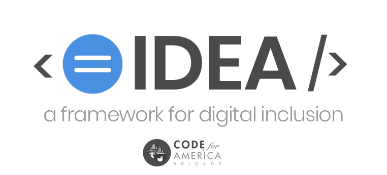

# CfA Brigade IDEA Framework



## Why a framework for digital inclusion?

_Inclusion_, _Diversity_, _Equity_, and _Accessibility_ aren't just 'nice-to-have' features in the building of civic-technology. They are prerequisites to successful outcomes.

And you can't just create IDEA via meeting a benchmark or seeking endpoint 'diversity.' 

You can't `npm` your way to equity. A command like this will return an error:

```
$ npm install inclusion -g
```


 Note: Using jargon like I just did can further create exclusionary environments; most people don't know what the heck `npm` means, nor need they.



