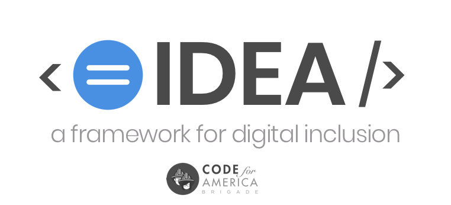

# 1. Context, purpose, and vision for IDEA



#### ORIGINALLY DRAFTED: _MAY 31, 2018_. 

#### APPROVED BY NATIONAL ADVISORY COMMITTEE: _TK_

### Principal Authors:

* [Ramy Kim](https://twitter.com/ramymik) \(OpenOakland\)
* [Carl V. Lewis](https://twitter.com/carlvlewis) \(OpenSavannah\)

## 1A. Why a framework for digital inclusion?

_Inclusion_, _Diversity_, _Equity_, and _Accessibility_ aren't just 'nice-to-have' features in the building of civic-technology with and for communities. They are prerequisites to achieving successful and sustainable outcomes.

Collectively, we will refer to inclusion, diversity, equity, and accessibility in this guide as IDEA. Each of the four parts of IDEA is connected to one another, yet all have a unique and separate meanings that Brigade leaders must understand and separate from one another when designing IDEA efforts and projects.

You can't build IDEA by meeting a benchmark, completing a deliverable, or seeking merely endpoint 'diversity' \(diversity only meets one of the four criteria needed in useful IDEA efforts\).

You can't `npm` your way to equity. A command like this will return an error:

```
$ npm install inclusion -g
```


 Note: Using jargon like we just did above is another form of exclusion–technical jargon; most people don't know what the heck `npm` means, nor need they. _Use_ [_plain language_](https://plainlanguage.gov) _as much as possible._ Keep sentences brief. Break up lengthy paragraphs using white space and other typographic or visual elements. For example, this warning box is a good example of one way to break lengthy text. 


Inclusion is a vague concept to grasp for many, particularly for those of us who are already included in the majority. Rather than focus solely on ways to be more inclusive, it's perhaps more useful to focus on the  force hampering inclusion: its antithesis, _exclusion_. 

Inclusion efforts that fail to acknowledge, recognize, and call out _exclusion_ for what it is – and who is responsible – will amount to little more than tokenism. Platitudes are cheap. Taking action to end exclusionary processes and systems is tough.

As Laurenellen McCann so astutely first pointed out in 2015:

> Our focus on inclusion is misplaced as long as it fails to change the structures and practices that promote exclusion in the first place . . . inclusion is inherently about exclusion. We can’t question the “in”, of course. We can’t look at what about “in” creates “out”. We can’t reflect beyond who is “not included” to [_what we are doing_](https://thsppl.com/i-racist-538512462265) _—_ individually, organizationally, systematically — that excludes.


